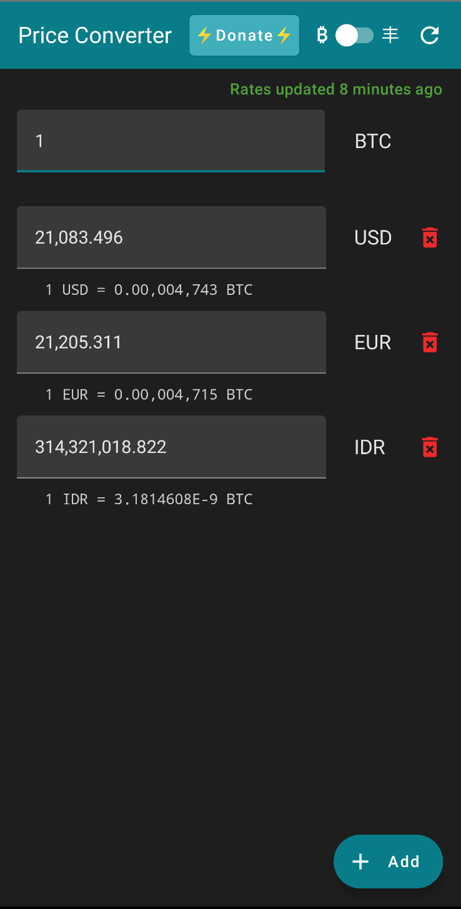

# Minimalistic Price Converter

`Minimalistic` | `Free` | `Open Source` | `Private` | `Bitcoin` | `No adds` | `No trackers` | `No Google`

Minimalistic app converting prices of fiat shitcoins and Bitcoin



## Features

- [x] Uses Bitcoin as base currency
- [x] Use rates as average from Bitpay, Blockchain.info and Coingecko
- [x] Supports Bitcoin and most of ISO fiat shitcoins
- [x] Swipe down refreshes rates 
- [x] Displays rates in sats-friendy format (`0.00,001,000`)

## Feature requests

This is minimalistic app that has one sole purpose. **It converts prices in grocery stores between
fiat shitcoins and uses Bitcoin as base currency.**

Only features that are aligned with the purpose of the app will be considered.

> **No other crypto shitcoins (so called "cryptocurrencies") will be added, unless there will be some *significant* vendor, that is denominating prices in them!**

## FAQ

1. **Why there are three decimal places for fiat shitcoins?**
   Gas prices are often denominated with that precision.

2. **Why is the rate of my favourite fiat shitcoin displayed like `1 SHIT = 1.345E-10 BTC`?**
   The app internally uses BTC as base currency and stores rates between BTC and fiat shitcoins with
   precision of 16 decimal places. Normally, it shows only 8 because that's 1 satoshi. If the
   shitcoin is so shitty that 1 unit of it is worth less then 1 sat
   the [scientific notation](https://en.wikipedia.org/wiki/Scientific_notation)
   is used to display it. If it is worth less then `1E-16` of BTC the app will round it to zero and
   won't work.

3. **What is the source of rates?** The app calculate averages of rates from those endpoints:
    - https://bitpay.com/rates
    - https://blockchain.info/ticker
    - https://api.coingecko.com/api/v3/exchange_rates

## Verify APK

Run this command on the downloaded APK

```
apksigner verify --print-certs --verbose minimalistic-price-converter-<version>.apk`
```

Output should contain following:

```
Verifies
Verified using v1 scheme (JAR signing): true
Verified using v2 scheme (APK Signature Scheme v2): true
Verified using v3 scheme (APK Signature Scheme v3): true
Number of signers: 1
Signer #1 certificate DN: CN=Hank Milliken, OU=Unknown, O=Unknown, L=Unknown, ST=Unknown, C=Unknown
Signer #1 certificate SHA-256 digest: 075ae3a04f6bbb359a65c0089a289ac143bf23bd3aa75631c9bacfedcb43e5b8
Signer #1 certificate SHA-1 digest: 6f9a462629fa5c12bfe41b0e11802d1a01c2ed77
Signer #1 certificate MD5 digest: 8cd5d74d31f4aedc9879313cd4e9fc2f
Signer #1 key algorithm: RSA
Signer #1 key size (bits): 2048
Signer #1 public key SHA-256 digest: b12341148aee3bdaccde418a24d9f38e01ec1ff2616246803e47373a517b6c9f
Signer #1 public key SHA-1 digest: 06b21c64b3052cd5775ce48969e31924defd7006
Signer #1 public key MD5 digest: 2d3223b33400839b3ba7dc4cfb4cd8cc
```

## Build from source

1. `git clone https://github.com/Minimalistic-Apps/price-converter.git`
2. `cd price-converter`
3. `JAVA_TOOL_OPTIONS=-Dfile.encoding=UTF8 ./gradlew assembleRelease`

## Signing the APK

Useful
guide: https://medium.com/modulotech/how-to-sign-an-unsigned-apk-using-command-line-636a056373a0

1. Generate
   key `keytool -genkey -v -keystore ~/.keystore/<your_name>.keystore -alias <your_alias> -keyalg RSA -keysize 2048 -validity 10000`
2. Sign
   apk `apksigner sign --ks ~/.keystore/<your_name>.keystore app/build/outputs/apk/release/app-release-unsigned.apk`
