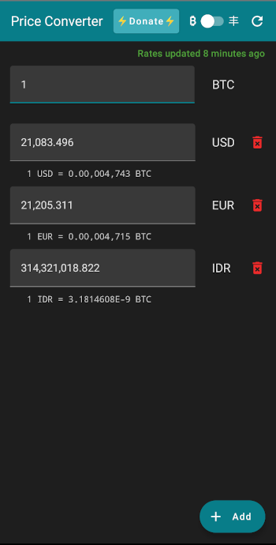

# Minimalistic Price Converter

`Minimalistic` | `Free` | `Open Source` | `Private` | `Bitcoin` | `No adds` | `No trackers`
| `No Google`

Minimalistic app converting prices of fiat shitcoins and Bitcoin

## Screenshot

## Features

- [x] Uses Bitcoin as base currency
- Use rates as average from
    - [x] Coingecko
    - [ ] Bitpay
    - [ ] Blockchain.info
- [x] Supports Bitcoin and most of ISO fiat shitcoins
- [x] Refresh button for current rates
- [x] Displays rates in sats-friendly format (`0.00,001,000`)
- [x] BTC and Sats mode, Sats has three decimal precision
- [x] When the input is selected, whole text is preselected to easily insert new value
- [ ] Ordering
- [x] Dark-mode

## Feature requests

This is minimalistic app that has one sole purpose. **It converts prices in grocery stores between
fiat shitcoins and uses Bitcoin as base currency.**

Only features that are aligned with the purpose of the app will be considered.

> **No other crypto shitcoins (so called "cryptocurrencies") will be added, unless there will be some *significant* vendor, that is denominating prices in them!**

## FAQ

1. **Why there are three decimal places for fiat shitcoins?**
   Gas prices are often denominated with that precision.

2. **Why is the rate of my favourite fiat shitcoin displayed like `1 SHIT = 1.345E-10 BTC`?**
   The app internally uses BTC as base currency and stores rates between BTC and fiat shitcoins with
   precision of 16 decimal places. Normally, it shows only 8 because that's 1 satoshi. If the
   shitcoin is so shitty that 1 unit of it is worth less then 1 sat
   the [scientific notation](https://en.wikipedia.org/wiki/Scientific_notation)
   is used to display it. If it is worth less then `1E-16` of BTC the app will round it to zero and
   won't work.

3. **What is the source of rates?** The app calculate averages of rates from those endpoints:
    - ~https://bitpay.com/ratesa~ (currently suspended)
    - ~https://blockchain.info/ticker~ (currently suspended)
    - https://api.coingecko.com/api/v3/exchange_rates

